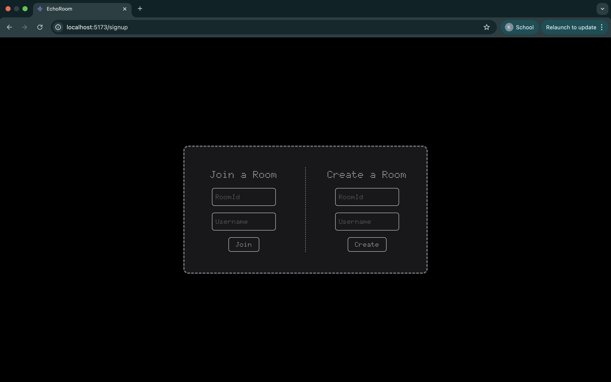

# Echoroom

EchoRoom is a real-time, room-based chat application built with WebSocket.
It allows users to join chat rooms and exchange messages instantly — no login or authentication required. Designed for simplicity and speed, EchoRoom delivers seamless messaging through a lightweight Node.js backend and a React frontend.

## Screenshots





## Features

- Room-Based Messaging
- Real-Time Communication
- No Login Required
- Lightweight Backend
- Auto Room Joining & Message Broadcasting


## Run Locally

Clone the project

```bash
  git clone https://github.com/ketan062/Echoroom.git
```

Go to the Backend directory

```bash
  cd backend
```
Install dependencies

```bash
  npm install
```

Start the server

```bash
  npm run dev
```
Go to the Frontend directory

```bash
  cd frontend/chatapp-frontend
```

Install dependencies

```bash
  npm install
```

Start the server

```bash
  npm run dev
```


